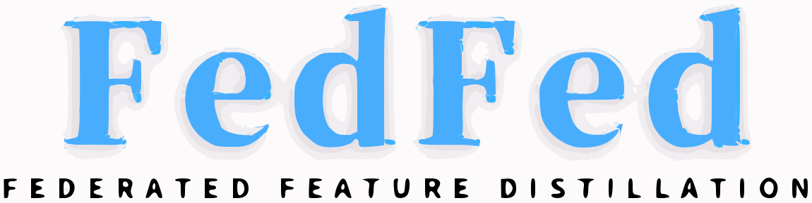
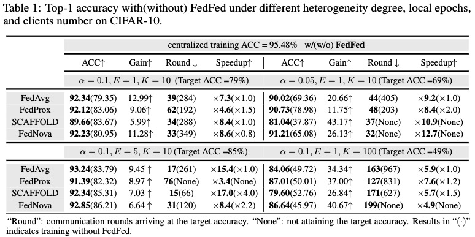

<p align="center">
    
</p>

<p align="center">
    <a href="https://arxiv.org/abs/2310.05077"></a>
    <a href="https://neurips.cc/"></a>
    <a href="https://github.com/visitworld123/FedFed"></a>
    <a href="https://github.com/visitworld123/FedFed/blob/main/LICENSE"></a>
    
</p>


<h1 align="center">FedFed: Feature Distillation against Data Heterogeneity in Federated Learning  (NeurIPS 2023)</h1>

Zhiqin Yang*, [Yonggang Zhang*](https://yonggangzhangben.github.io/index.html), [Yu Zheng](https://scholar.google.com/citations?user=fH3uUgYAAAAJ&hl=zh-CN&oi=ao), 
[Xinmei Tian](https://scholar.google.com/citations?user=-tels3wAAAAJ&hl=zh-CN&oi=ao), [Hao Peng](https://penghao-bdsc.github.io/), [Tongliang Liu](https://tongliang-liu.github.io/), [Bo Han](https://bhanml.github.io/)

**Keywords**: Feature Distillation, Data Heterogeneity, Federated Learning

**Abstract**: Federated learning (FL) typically faces data heterogeneity, i.e., distribution shifting among clients. Sharing clients’ information has shown great potentiality in mitigating data heterogeneity, yet incurs a dilemma in preserving privacy and promoting model performance. To alleviate the dilemma, we raise a fundamental question: Is it possible to share partial features in the data to tackle data heterogeneity? In this work, we give an affirmative answer to this question by proposing a novel approach called **Fed**erated **Fe**ature **d**istillation (FedFed). Specifically, FedFed partitions data into performance-sensitive features (i.e., greatly contributing to model performance) and performance-robust features (i.e., limitedly contributing to model performance). The performance-sensitive features are globally shared to mitigate data heterogeneity, while the performance-robust features are kept locally. FedFed enables clients to train models over local and shared data. Comprehensive experiments demonstrate the efficacy of FedFed in promoting model performance

## The Table of Contents
- [:grimacing: Dependencies and installation](#grimacing-dependencies-and-installation)
- [:partying\_face: How to run:](#partying_face-how-to-run)
- [:gem: Extension based on our code](#gem-extension-based-on-our-code)
  - [:book: Main code structure](#book-main-code-structure)
  - [:jigsaw: How to extend based on our code](#jigsaw-how-to-extend-based-on-our-code)
- [:rose: Experimental results](#rose-experimental-results)
- [:smiley: Citation](#smiley-citation)
- [:closed\_book: License](#closed_book-license)
- [:smiling\_face\_with\_three\_hearts: Acknowledgement](#smiling_face_with_three_hearts-acknowledgement)
- [:phone: Contact](#phone-contact)

:wink: If FedFed is helpful to you, please star this repo. Thanks! :hugs: 


##  :grimacing: Dependencies and installation
Before running or modifying the code, you need to:
- Make sure Anaconda or Miniconda is installed.
- Clone this repo to your machine.
  
  ```
  # git clone this repository
  git clone https://github.com/visitworld123/FedFed
  cd FedFed

  # create new anaconda env 
  conda create -n FedFed python=3.8 -y
  conda activate FedFed  
  ```
- required environment in `environment.yaml`
  ```
  # install environment dependencies
  conda env create -f environment.yaml
  ```
- required packages in `requirements.txt`
  ```
  # install python dependencies
  pip install -r requirements.txt
  ```

## :partying_face: How to run:

```
python main.py --config_file config.yaml
```

In config.yaml, you can change the hyper-parameters and some settings. In our experiments, we use wandb as the default tool to record the running metrics like Acc and Loss. If you don't want to use wandb, you can set `wandb_record = False`. And if you want to use tensorboard to record, you can set `record_tool = 'tensorboard`.

Please refer to the `./configs/default.py` file for the list of parameters. We list some main parameters and its meaning to help quick start. 

You can set these parameters by modify  `default.py` or a new `yaml` file and use it by `--config_file xxx.yaml`. 

`--client_num_in_total`: The total number of clients in FL system, you can set 10 and 100 to reproduce our experiments.

`--client_num_per_round`: The number of sampled clients every round, also called sampling rate.

`--partition_alpha`: Our main results based on LDA partition method, you can set 0.1 and 0.05.

`--global_epochs_per_round`: Local epochs for every client.

`--comm_round`: Global Communication round.


## :gem: Extension based on our code

### :book: Main code structure
```
├── algorithms_standalone
│   ├── basePS
│   │   ├── aggregator.py       # Details of federated aggregation, one can extend based on this 
│   │   ├── basePSmanager.py    # Details of federated manager, one can extend based on this 
│   │   └── client.py           # Details of federated clients, one can extend based on this 
│   ├── fedavg                  # FedAvg folder, this folder also including FedProx and SCAFFOLD
│   │   ├── FedAVGManager.py    # FedAvg manager, based on basePS
│   │   ├── aggregator.py       # FedAvg aggregator, based on basePS
│   │   └── client.py           # FedAvg clients, based on basePS
│   └── fednova
│       ├── FedNovaManager.py   # FedNova manager, based on basePS
│       ├── aggregator.py       # FedNova aggregator, based on basePS
│       └── client.py           # FedNova clients, based on basePS
├── configs
│   ├── config.py
│   └── default.py              # Manage parameters by default 
├── data_preprocessing          # Process dataset into heter distribution across clients
│   ├── loader.py
│   └── build.py
├── loss_fn                     # Some loss functions can be choose
├── model
│   ├── FL_VAE.py               # Model for feature distillation
│   ├── build.py
│   ├── cv                      # Local classifier model of federated learning in CV
├── optim                       # Build optimizer for local client
│   └── build.py
├── trainers
│   └── normal_trainer.py       # Details of local training
├── utils
├── main.py
└── config.yaml                

```
### :jigsaw: How to extend based on our code
 In the directory of `/algorithms_standalone/basePS`. It contains three file: aggregator.py, basePSmanager.py, and client.py. 
 
 These three files have some basic functions that in FL. If you want to implement your own algorithm based on our code. Your new aggregator, client and manager can inherit from these basic classes. 

 
## :rose: Experimental results
 <p align="center">
    
</p>

## :smiley: Citation
If our work is useful for your research, please consider citing:

    @inproceedings{
        yang2023fedfed,
        title={FedFed: Feature Distillation against Data Heterogeneity in Federated Learning},
        author={Zhiqin Yang and Yonggang Zhang and Yu Zheng and Xinmei Tian and Hao Peng and Tongliang Liu and Bo Han},
        booktitle={Thirty-seventh Conference on Neural Information Processing Systems},
        year={2023}
    }


## :closed_book: License

This project is licensed under <a rel="license" href=""> MIT</a>. Redistribution and use should follow this license.

## :smiling_face_with_three_hearts: Acknowledgement

This project is partly based on [VHL](https://github.com/wizard1203/VHL) and [CD-VAE](https://github.com/kai-wen-yang/CD-VAE). 

This Readme is inspired by [codeformer](https://github.com/sczhou/CodeFormer) :smile:.

## :phone: Contact
If you have any questions, please feel free to reach me out at `yangzqccc@buaa.edu.cn`. 

## Star History

[](https://star-history.com/#visitworld123/FedFed&Date)
